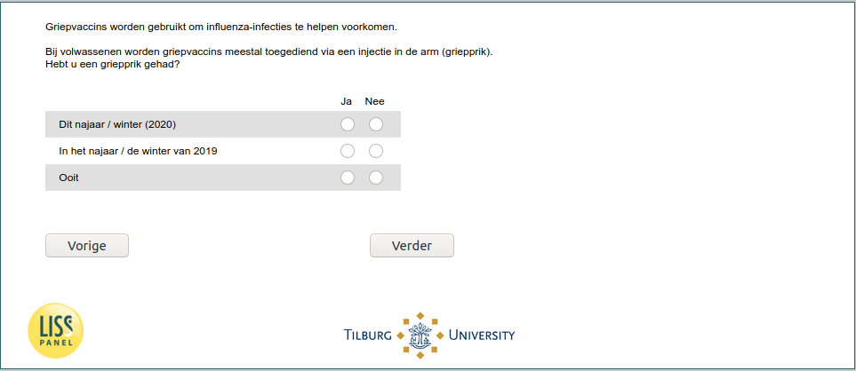

.. _w6d-flushot: 

 
 .. role:: raw-html(raw) 
        :format: html 
 
`flushot` – Taken Influenza Vaccine
============================================= 

:raw-html:`←` :ref:`w6d-covid_test_prob2` | :ref:`w6d-influenza_vaccine_2020_yes_reason` :raw-html:`→` 
 

Griepvaccins worden gebruikt om influenza-infecties te helpen voorkomen.

Bij volwassenen worden griepvaccins meestal toegediend via een injectie in de arm (griepprik).
Hebt u een griepprik gehad?
 
.. csv-table:: 
   :delim: | 
   :header: ,Ja,Nee
 
           Ooit | :raw-html:`❏` | :raw-html:`❏` 
           Dit najaar / winter (2020) | :raw-html:`❏` | :raw-html:`❏` 
           In het najaar / de winter van 2019 | :raw-html:`❏` | :raw-html:`❏` 

:raw-html:`←` :ref:`w6d-covid_test_prob2` | :ref:`w6d-influenza_vaccine_2020_yes_reason` :raw-html:`→` 
 
