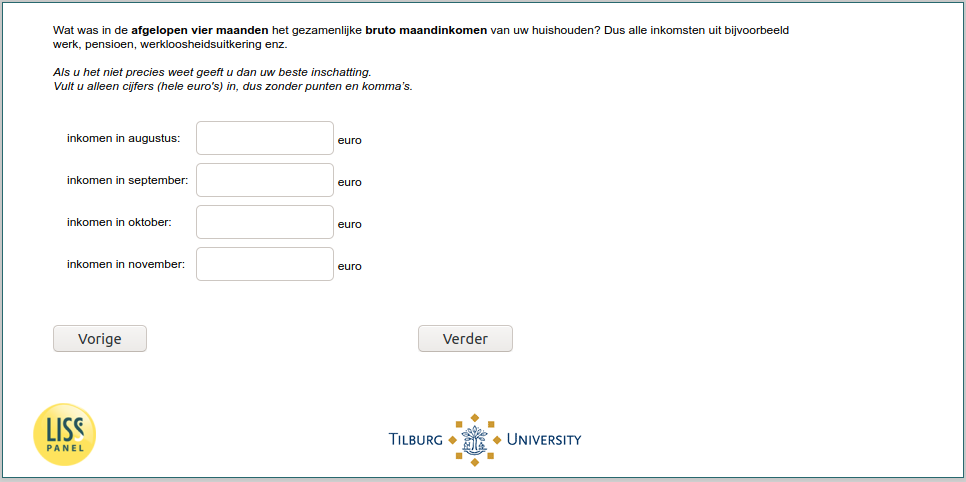

.. _w6d-inc: 

 
 .. role:: raw-html(raw) 
        :format: html 
 
`inc` – Income
==================== 

:raw-html:`&larr;` :ref:`w6d-q27_ex_1` | :ref:`w6d-expinc2020` :raw-html:`&rarr;` 
 

Wat was in de afgelopen vier maanden [if (p_aantalhh = 1): uw bruto maandinkomen/ if (p_aantalhh ≠ 1): het gezamenlijke bruto maandinkomen van uw huishouden]? Dus alle inkomsten uit bijvoorbeeld werk, pensioen, werkloosheidsuitkering enz.

Als u het niet precies weet geeft u dan uw beste inschatting.
Vult u alleen cijfers (hele euro's) in, dus zonder punten en komma’s.
 
.. csv-table:: 
   :delim: | 
 
           inkomen in augustus: | :raw-html:`<form><input type="text" id="fname" name="fname"> </form>` 
           inkomen in september: | :raw-html:`<form><input type="text" id="fname" name="fname"> </form>` 
           inkomen in oktober: | :raw-html:`<form><input type="text" id="fname" name="fname"> </form>` 
           inkomen in november: | :raw-html:`<form><input type="text" id="fname" name="fname"> </form>` 

:raw-html:`&larr;` :ref:`w6d-q27_ex_1` | :ref:`w6d-expinc2020` :raw-html:`&rarr;` 
 
