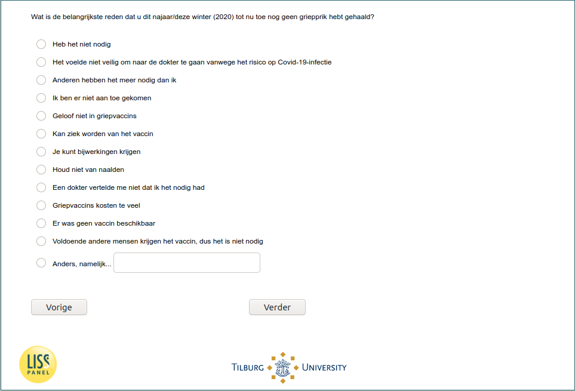

.. _w6d-influenza_vaccine_2020_no_reason: 

 
 .. role:: raw-html(raw) 
        :format: html 
 
`influenza_vaccine_2020_no_reason` – Reason for Not Taking Influenza Vaccine
=============================================================================================================== 

:raw-html:`&larr;` :ref:`w6d-influenza_vaccine_2020_yes_reason` | :ref:`w6d-influenza_vaccine_2020_prob` :raw-html:`&rarr;` 
 
*Routing to the question depends on answer in:* :ref:`w6d-flushot` 

Wat is de belangrijkste reden dat u dit najaar/deze winter (2020) tot nu toe nog geen griepprik hebt gehaald?

:raw-html:`&#10063;` – Heb het niet nodig

:raw-html:`&#10063;` – Het voelde niet veilig om naar de dokter te gaan vanwege het risico op Covid-19-infectie

:raw-html:`&#10063;` – Anderen hebben het meer nodig dan ik

:raw-html:`&#10063;` – Ik ben er niet aan toe gekomen

:raw-html:`&#10063;` – Geloof niet in griepvaccins

:raw-html:`&#10063;` – Kan ziek worden van het vaccin

:raw-html:`&#10063;` – Je kunt bijwerkingen krijgen

:raw-html:`&#10063;` – Houd niet van naalden

:raw-html:`&#10063;` – Een dokter vertelde me niet dat ik het nodig had

:raw-html:`&#10063;` – Griepvaccins kosten te veel

:raw-html:`&#10063;` – Er was geen vaccin beschikbaar

:raw-html:`&#10063;` – Anders, namelijk...

 

:raw-html:`&larr;` :ref:`w6d-influenza_vaccine_2020_yes_reason` | :ref:`w6d-influenza_vaccine_2020_prob` :raw-html:`&rarr;` 
 
