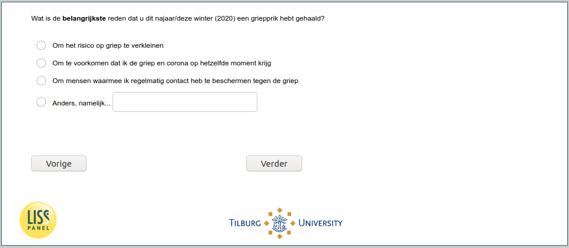

.. _w6d-influenza_vaccine_2020_yes_reason: 

 
 .. role:: raw-html(raw) 
        :format: html 
 
`influenza_vaccine_2020_yes_reason` – Reason for Taking Influenza Vaccine
============================================================================================================= 

:raw-html:`&larr;` :ref:`w6d-flushot` | :ref:`w6d-influenza_vaccine_2020_no_reason` :raw-html:`&rarr;` 
 
*Routing to the question depends on answer in:* :ref:`w6d-flushot` 

Wat is de belangrijkste reden dat u dit najaar/deze winter (2020) een griepprik hebt gehaald?

:raw-html:`&#10063;` – Om het risico op griep te verkleinen

:raw-html:`&#10063;` – Om te voorkomen dat ik de griep en corona op hetzelfde moment krijg

:raw-html:`&#10063;` – Om mensen waarmee ik regelmatig contact heb te beschermen tegen de griep

:raw-html:`&#10063;` – Anders, namelijk...

 

:raw-html:`&larr;` :ref:`w6d-flushot` | :ref:`w6d-influenza_vaccine_2020_no_reason` :raw-html:`&rarr;` 
 
