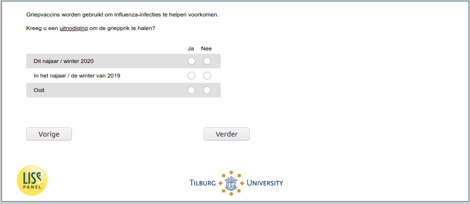

.. _w6d-invite: 

 
 .. role:: raw-html(raw) 
        :format: html 
 
`invite` – Invite to Take Influenza Vaccine
==================================================== 

:raw-html:`&larr;` :ref:`w6d-influenza_vaccine_2020_prob` | :ref:`w6d-invite_means` :raw-html:`&rarr;` 
 

Griepvaccins worden gebruikt om influenza-infecties te helpen voorkomen.

Kreeg u een uitnodiging om de griepprik te halen?
 
.. csv-table:: 
   :delim: |
   :header: ,Ja,Nee 
 
           Dit najaar / winter 2020 | :raw-html:`&#10063;` 
           In het najaar / de winter van 2019 | :raw-html:`&#10063;` 
           Ooit | :raw-html:`&#10063;` 

:raw-html:`&larr;` :ref:`w6d-influenza_vaccine_2020_prob` | :ref:`w6d-invite_means` :raw-html:`&rarr;` 
 
