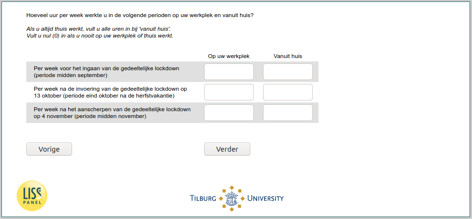

.. _w6d-lockdown: 

 
 .. role:: raw-html(raw) 
        :format: html 
 
`lockdown` – Work During Lockdown
============================================ 

:raw-html:`←` :ref:`w6d-worked_past_3m` | :ref:`w6d-work_perc` :raw-html:`→` 
 
*Routing to the question depends on answer in:* :ref:`w6d-EmploymentStatus` 

Hoeveel uur per week werkte u in de volgende perioden op uw werkplek en vanuit huis?

Als u altijd thuis werkt, vult u alle uren in bij 'vanuit huis'.
Vult u nul (0) in als u nooit op uw werkplek of thuis werkt.
 
.. csv-table::
   :header: ,Op uw werkplek, Vanuit huis
   :delim: | 
 
           Per week voor het ingaan van de gedeeltelijke lockdown (periode midden september)| :raw-html:`<form><input type="text" id="fname" name="fname"> </form>` | :raw-html:`<form><input type="text" id="fname" name="fname"> </form>` 
           Per week na de invoering van de gedeeltelijke lockdown op 13 oktober (periode eind oktober na de herfstvakantie)| :raw-html:`<form><input type="text" id="fname" name="fname"> </form>` | :raw-html:`<form><input type="text" id="fname" name="fname"> </form>` 
           Per week na het aanscherpen van de gedeeltelijke lockdown op 4 november (periode midden november)| :raw-html:`<form><input type="text" id="fname" name="fname"> </form>` | :raw-html:`<form><input type="text" id="fname" name="fname"> </form>` 

:raw-html:`&larr;` :ref:`w6d-worked_past_3m` | :ref:`w6d-work_perc` :raw-html:`&rarr;` 
 
