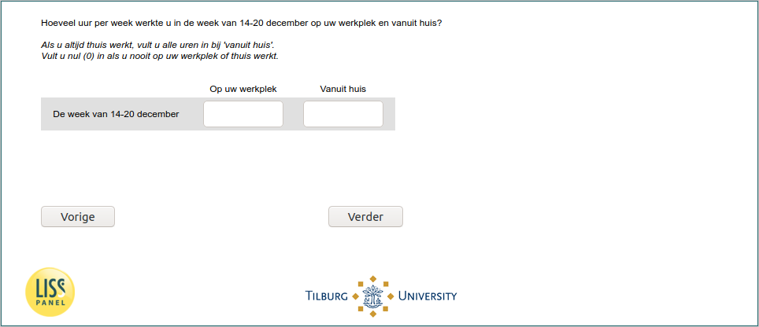

.. _w6d-q14: 

 
 .. role:: raw-html(raw) 
        :format: html 
 
`q14` – Work Time Remote and Workplace
============================================ 

:raw-html:`←` :ref:`w6d-EmploymentStatus` | :ref:`w6d-vacsick` :raw-html:`→` 
 
*Routing to the question depends on answer in:* :ref:`w6d-EmploymentStatus` 

Hoeveel uur per week werkte u in de [if _current_date<2020-12-21: afgelopen zeven dagen / if _current_date>=2020-12-21: week van 14-20 december] op uw werkplek en vanuit huis?

Als u altijd thuis werkt, vult u alle uren in bij 'vanuit huis'.
Vult u nul (0) in als u nooit op uw werkplek of thuis werkt.
 
.. csv-table::
   :header: ,Op uw werkplek Nee,Vanuit huis
   :delim: | 
 
           De [if _current_date<2020-12-21: afgelopen zeven dagen/ if _current_date>=2020-12-21: week van 14-20 december]| :raw-html:`<form><input type="text" id="fname" name="fname"> </form>`| :raw-html:`<form><input type="text" id="fname" name="fname"> </form>`  

:raw-html:`&larr;` :ref:`w6d-EmploymentStatus` | :ref:`w6d-vacsick` :raw-html:`&rarr;` 
 
