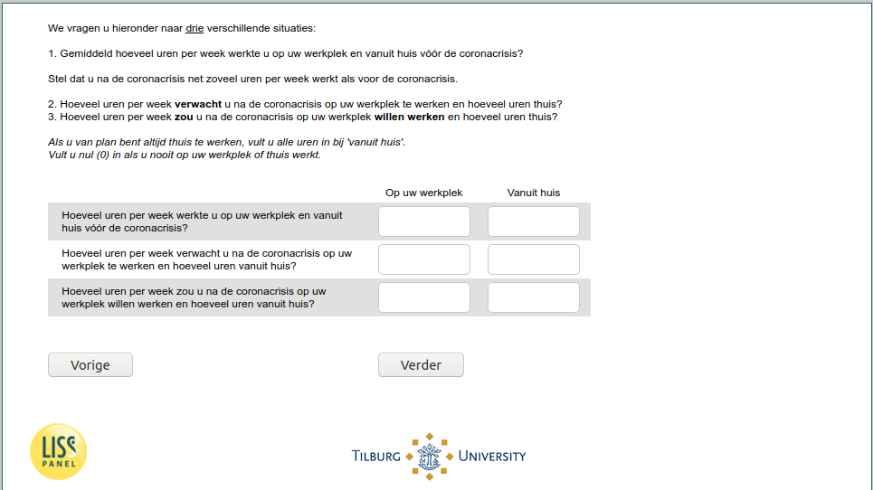

.. _w6d-uren_corona: 

 
 .. role:: raw-html(raw) 
        :format: html 
 
`uren_corona` – Work from Home
============================================ 

:raw-html:`&larr;` :ref:`w6d-work_perc` | :ref:`w6d-JobSearch` :raw-html:`&rarr;` 
 
*Routing to the question depends on answer in:* :ref:`w6d-EmploymentStatus` 

We vragen u hieronder naar drie verschillende situaties:
1. Gemiddeld hoeveel uren per week werkte u op uw werkplek en vanuit huis vóór de coronacrisis?

Stel dat u na de coronacrisis net zoveel uren per week werkt als voor de coronacrisis.

2. Hoeveel uren per week verwacht u na de coronacrisis op uw werkplek te werken en hoeveel uren thuis?
3. Hoeveel uren per week zou u na de coronacrisis op uw werkplek willen werken en hoeveel uren thuis?

Als u van plan bent altijd thuis te werken, vult u alle uren in bij 'vanuit huis'.
Vult u nul (0) in als u nooit op uw werkplek of thuis werkt.
 
.. csv-table:: 
   :header: ,Op uw werkplek, Vanuit huis
   :delim: | 
 
           Hoeveel uren per week werkte u op uw werkplek en vanuit huis vóór de coronacrisis? | :raw-html:`<form><input type="text" id="fname" name="fname"> </form>` | :raw-html:`<form><input type="text" id="fname" name="fname"> </form>` 
           Hoeveel uren per week verwacht u na de coronacrisis op uw werkplek te werken en hoeveel uren vanuit huis? | :raw-html:`<form><input type="text" id="fname" name="fname"> </form>` | :raw-html:`<form><input type="text" id="fname" name="fname"> </form>` 
           Hoeveel uren per week zou u na de coronacrisis op uw werkplek willen werken en hoeveel uren vanuit huis? | :raw-html:`<form><input type="text" id="fname" name="fname"> </form>` | :raw-html:`<form><input type="text" id="fname" name="fname"> </form>` 

:raw-html:`&larr;` :ref:`w6d-work_perc` | :ref:`w6d-JobSearch` :raw-html:`&rarr;` 
 
