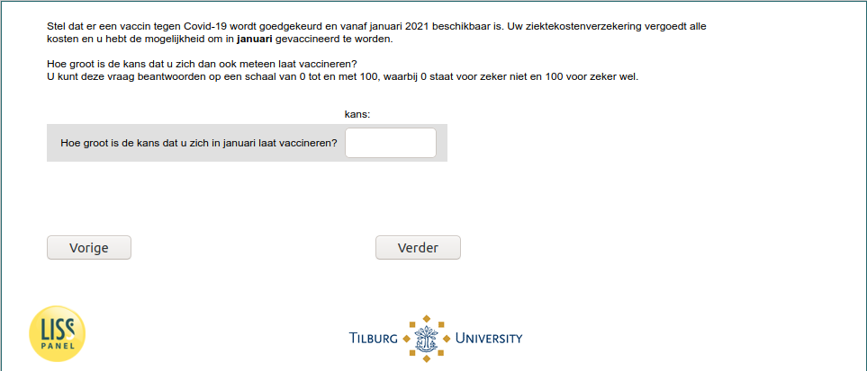

.. _w6d-vaccine_intention_jan: 

 
 .. role:: raw-html(raw) 
        :format: html 
 
`vaccine_intention_jan` – Vaccine Intention - January
============================================================================= 

:raw-html:`←` :ref:`w6d-q1header` | :ref:`w6d-vaccine_intention_jul` :raw-html:`→` 
 

Stel dat er een vaccin tegen Covid-19 wordt goedgekeurd en vanaf januari 2021 beschikbaar is. Uw ziektekostenverzekering vergoedt alle kosten en u hebt de mogelijkheid om in januari gevaccineerd te worden.
Hoe groot is de kans dat u zich dan ook meteen laat vaccineren? U kunt deze vraag beantwoorden op een schaal van 0 tot en met 100, waarbij 0 staat voor zeker niet en 100 voor zeker wel.
 
.. csv-table:: 
   :delim: | 
 
           Hoe groot is de kans dat u zich in januari laat vaccineren? | :raw-html:`<form><input type="text" id="fname" name="fname"> </form>` 

:raw-html:`&larr;` :ref:`w6d-q1header` | :ref:`w6d-vaccine_intention_jul` :raw-html:`&rarr;` 
 
