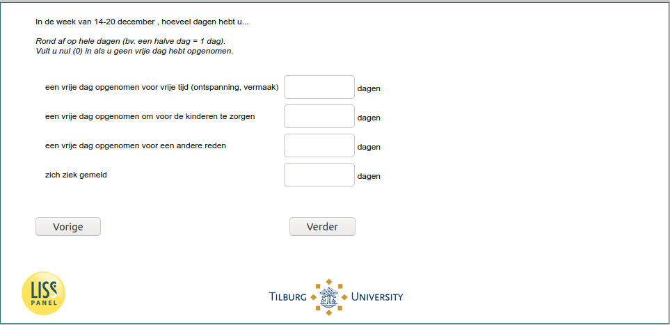

.. _w6d-vacsick: 

 
 .. role:: raw-html(raw) 
        :format: html 
 
`vacsick` – Vacation & Sickness
========================================= 

:raw-html:`←` :ref:`w6d-q14` | :ref:`w6d-worked_past_3m` :raw-html:`→` 
 
*Routing to the question depends on answer in:* :ref:`w6d-EmploymentStatus` 

In de [if _current_date<2020-12-21: afgelopen zeven dagen/ if _current_date>=2020-12-21: week van 14-20 december], hoeveel dagen hebt u...

Rond af op hele dagen (bv. een halve dag = 1 dag).
Vult u nul (0) in als u geen vrije dag hebt opgenomen.
 
.. csv-table:: 
   :delim: | 
 
           een vrije dag opgenomen voor vrije tijd (ontspanning, vermaak) | :raw-html:`<form><input type="text" id="fname" name="fname"> </form>` 
           een vrije dag opgenomen om voor de kinderen te zorgen | :raw-html:`<form><input type="text" id="fname" name="fname"> </form>` 
           een vrije dag opgenomen voor een andere reden | :raw-html:`<form><input type="text" id="fname" name="fname"> </form>` 
           zich ziek gemeld | :raw-html:`<form><input type="text" id="fname" name="fname"> </form>` 

:raw-html:`&larr;` :ref:`w6d-q14` | :ref:`w6d-worked_past_3m` :raw-html:`&rarr;` 
 
