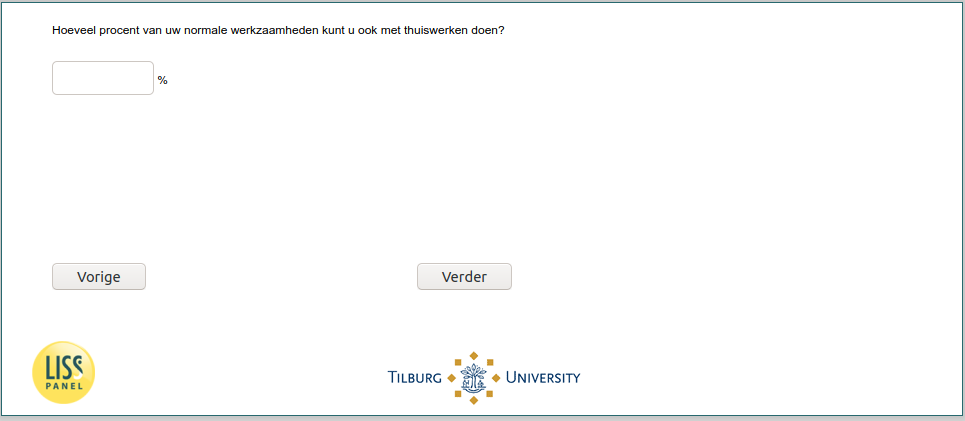

.. _w6d-work_perc: 

 
 .. role:: raw-html(raw) 
        :format: html 
 
`work_perc` – Percentage of Work from Home
====================================================== 

:raw-html:`&larr;` :ref:`w6d-lockdown` | :ref:`w6d-uren_corona` :raw-html:`&rarr;` 
 
*Routing to the question depends on answer in:* :ref:`w6d-EmploymentStatus` 

Hoeveel procent van uw normale werkzaamheden kunt u ook met thuiswerken doen? 
 

:raw-html:`&larr;` :ref:`w6d-lockdown` | :ref:`w6d-uren_corona` :raw-html:`&rarr;` 
 
