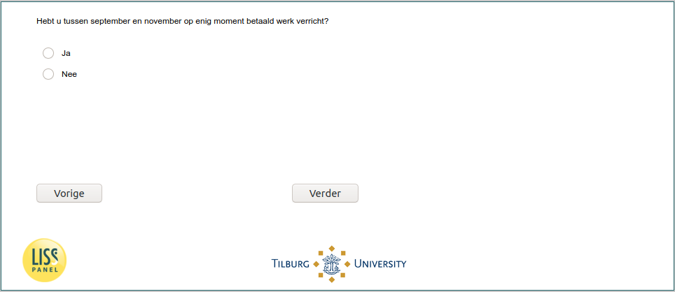

.. _w6d-worked_past_3m: 

 
 .. role:: raw-html(raw) 
        :format: html 
 
`worked_past_3m` – Worked Past Three Months
============================================================ 

:raw-html:`&larr;` :ref:`w6d-vacsick` | :ref:`w6d-lockdown` :raw-html:`&rarr;` 
 
*Routing to the question depends on answer in:* :ref:`w6d-EmploymentStatus` 

Hebt u tussen september en november op enig moment betaald werk verricht?
 
.. csv-table:: 
   :delim: | 
   :header: Ja,Nee
 
           :raw-html:`&#10063;`|:raw-html:`&#10063;` 

:raw-html:`&larr;` :ref:`w6d-vacsick` | :ref:`w6d-lockdown` :raw-html:`&rarr;` 
 
