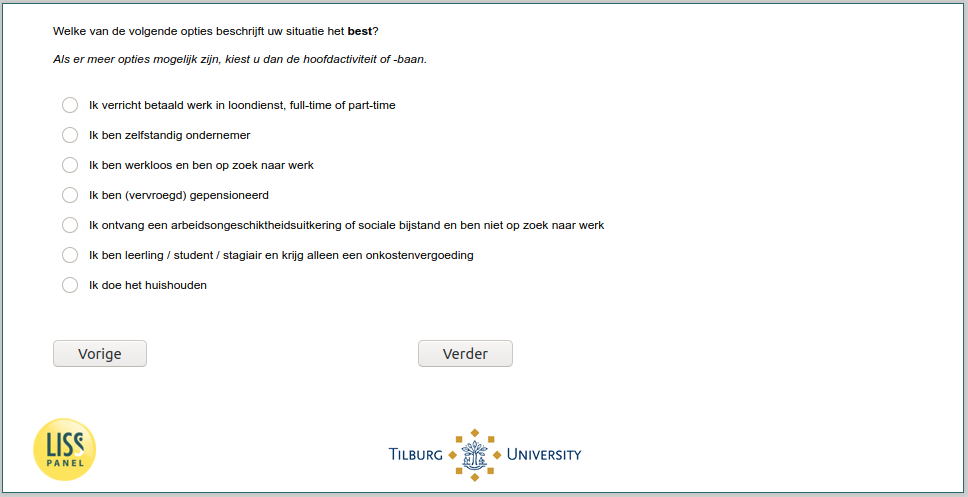

.. _w6e-EmploymentStatus: 

 
 .. role:: raw-html(raw) 
        :format: html 
 
`EmploymentStatus` – Employment Status
========================================================= 

:raw-html:`&larr;` :ref:`w6e-q8` | :ref:`w6e-q14` :raw-html:`&rarr;` 
 

Which of the following options best describes your situation?

If more options are possible, please choose the main activity or job.
 
.. csv-table:: 
   :delim: | 
   :header: I perform gainful employment full-time or part-time ,I am self-employed ,I am unemployed and looking for work ,I am retired (early) ,I receive disability benefits or social assistance and am not looking for work ,I am an apprentice / student / trainee and only receive a reimbursement of expenses ,I do the household
 
           :raw-html:`&#10063;`|:raw-html:`&#10063;`|:raw-html:`&#10063;`|:raw-html:`&#10063;`|:raw-html:`&#10063;`|:raw-html:`&#10063;`|:raw-html:`&#10063;` 

:raw-html:`&larr;` :ref:`w6e-q8` | :ref:`w6e-q14` :raw-html:`&rarr;` 
 
