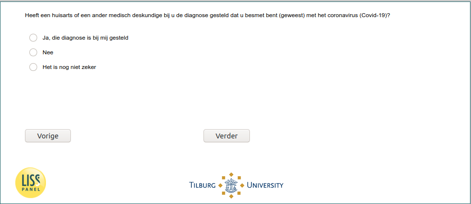

.. _w6e-InfectionDiagnosed: 

 
 .. role:: raw-html(raw) 
        :format: html 
 
`InfectionDiagnosed` – Infection Diagnosed
=============================================================== 

:raw-html:`&larr;` :ref:`w6e-intro` | :ref:`w6e-q1header` :raw-html:`&rarr;` 
 

Have you been diagnosed by a general practitioner or other medical professional as are or have been infected with coronavirus (Covid-19)?

:raw-html:`&#10063;` – Yes I have been diagnosed with that

:raw-html:`&#10063;` – No

:raw-html:`&#10063;` – It is not certain yet

:raw-html:`&larr;` :ref:`w6e-intro` | :ref:`w6e-q1header` :raw-html:`&rarr;` 
 
