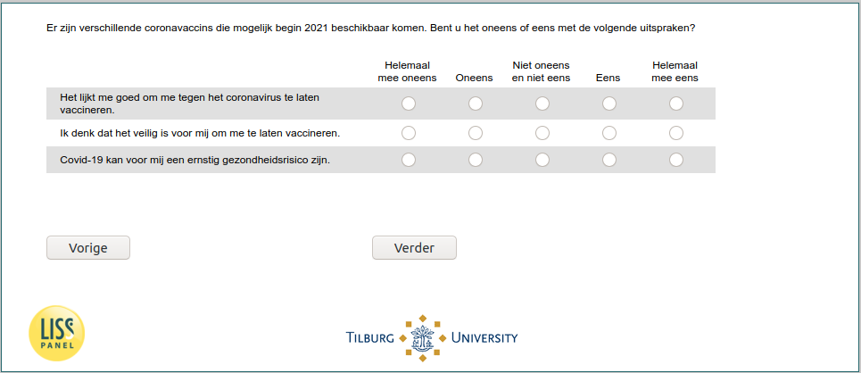

.. _w6e-covid_attitudes: 

 
 .. role:: raw-html(raw) 
        :format: html 
 
`covid_attitudes` – COVID Attitudes
===================================================== 

:raw-html:`&larr;` :ref:`w6e-vaccine_intention_jul` | :ref:`w6e-covid_test_prob1` :raw-html:`&rarr;` 
 

There are several corona vaccines that may become available in early 2021. Do you disagree or agree with the following statements?
 
.. csv-table:: 
   :delim: | 
   :header: ,Strongly disagree,Disagree,Neither disagree nor disagree,Agree,Strongly agree
 
           I think it would be good to get vaccinated against the coronavirus. | :raw-html:`&#10063;`|:raw-html:`&#10063;`|:raw-html:`&#10063;`|:raw-html:`&#10063;`|:raw-html:`&#10063;` 
           I think it's safe for me to get vaccinated. | :raw-html:`&#10063;`|:raw-html:`&#10063;`|:raw-html:`&#10063;`|:raw-html:`&#10063;`|:raw-html:`&#10063;` 
           Covid-19 may be a serious health risk for me. | :raw-html:`&#10063;`|:raw-html:`&#10063;`|:raw-html:`&#10063;`|:raw-html:`&#10063;`|:raw-html:`&#10063;` 

:raw-html:`&larr;` :ref:`w6e-vaccine_intention_jul` | :ref:`w6e-covid_test_prob1` :raw-html:`&rarr;` 
 
