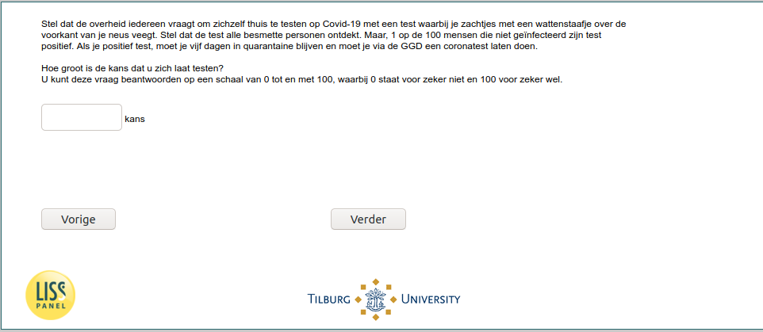

.. _w6e-covid_test_prob1: 

 
 .. role:: raw-html(raw) 
        :format: html 
 
`covid_test_prob1` – Test Probabilities – 1
============================================================== 

:raw-html:`&larr;` :ref:`w6e-covid_attitudes` | :ref:`w6e-covid_test_prob2` :raw-html:`&rarr;` 
 

Suppose the government asks everyone to test themselves at home for Covid-19 with a test in which you gently wipe the front of your nose with a cotton swab. Suppose the test detects all infected individuals. But, 1 in 100 people who are not infected tests positive. If you test positive, you have to stay in quarantine for five days and have to go through the GGD to have a coronavirus test done.

How likely are you to get tested?
You can answer this question on a scale of 0 to 100, where 0 stands for definitely not and 100 for definitely yes. 
 

:raw-html:`&larr;` :ref:`w6e-covid_attitudes` | :ref:`w6e-covid_test_prob2` :raw-html:`&rarr;` 
 
