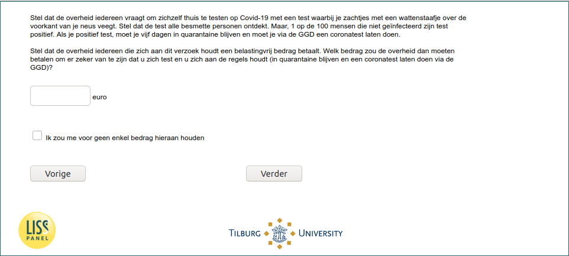

.. _w6e-covid_test_prob2: 

 
 .. role:: raw-html(raw) 
        :format: html 
 
`covid_test_prob2` – Test Probabilities – 2
============================================================== 

:raw-html:`&larr;` :ref:`w6e-covid_test_prob1` | :ref:`w6e-flushot` :raw-html:`&rarr;` 
 

Suppose the government asks everyone to test themselves at home for Covid-19 with a test in which you gently wipe the front of your nose with a cotton swab. Suppose the test detects all infected individuals. But, 1 in 100 people who are not infected tests positive. If you test positive, you have to stay in quarantine for five days and have to go through the GGD to have a coronavirus test done.

Suppose the government pays everyone who complies with this request a tax-free amount of money pay. What amount would the government then have to pay to make sure that you and you follow the rules (stay in quarantine and have a coronavirus done via the GGD)? done through the GGD)? 
 

:raw-html:`&larr;` :ref:`w6e-covid_test_prob1` | :ref:`w6e-flushot` :raw-html:`&rarr;` 
 
