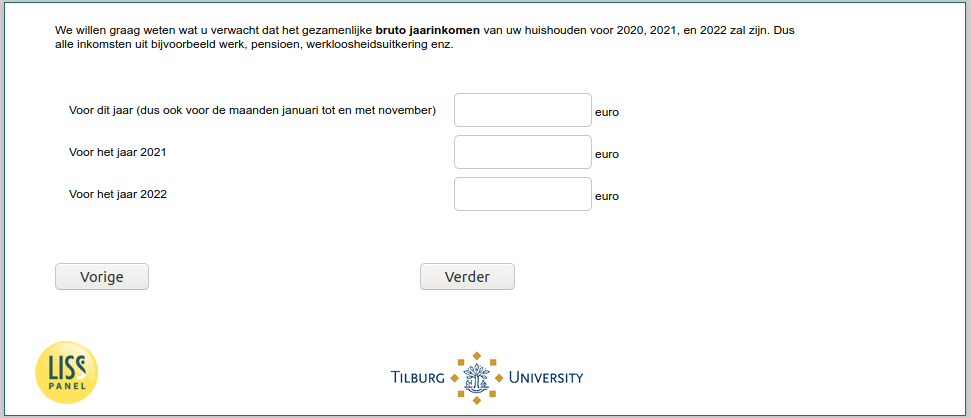

.. _w6e-expinc2020: 

 
 .. role:: raw-html(raw) 
        :format: html 
 
`expinc2020` – Expected Income
=========================================== 

:raw-html:`&larr;` :ref:`w6e-inc` | :ref:`w6e-ExpUnempl_today` :raw-html:`&rarr;` 
 

We would like to know what you expect [if (p_numberhh = 1): your gross annual income/ if (p_numberhh ≠ 1): your household's combined gross annual income] to be for 2020, 2021, and 2022. So all income from, for example, work, pension, unemployment benefits, etc.
 
.. csv-table:: 
   :delim: | 
 
           For this year (i.e., also for the months of January through November) | :raw-html:`<form><input type="text" id="fname" name="fname"> </form>` 
           For the year 2021 | :raw-html:`<form><input type="text" id="fname" name="fname"> </form>` 
           For the year 2022 | :raw-html:`<form><input type="text" id="fname" name="fname"> </form>` 

:raw-html:`&larr;` :ref:`w6e-inc` | :ref:`w6e-ExpUnempl_today` :raw-html:`&rarr;` 
 
