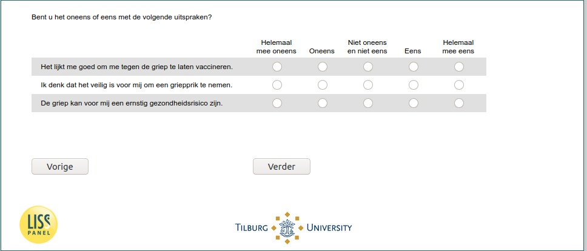

.. _w6e-flu_attitudes: 

 
 .. role:: raw-html(raw) 
        :format: html 
 
`flu_attitudes` – Influenza Attitudes
===================================================== 

:raw-html:`&larr;` :ref:`w6e-flushot_past10y` | :ref:`w6e-q30hd_maand` :raw-html:`&rarr;` 
 

Do you disagree or agree with the following statements?
 
.. csv-table:: 
   :delim: | 
   :header: ,Strongly disagree,Disagree,Neither disagree nor disagree,Agree,Strongly agree
 
           I think it would be good for me to get vaccinated against the flu. | :raw-html:`&#10063;` |:raw-html:`&#10063;` |:raw-html:`&#10063;` |:raw-html:`&#10063;` |:raw-html:`&#10063;` 
           I think it is safe for me to get a flu shot. | :raw-html:`&#10063;` |:raw-html:`&#10063;` |:raw-html:`&#10063;` |:raw-html:`&#10063;` |:raw-html:`&#10063;` 
           The flu can be a serious health risk for me. | :raw-html:`&#10063;` |:raw-html:`&#10063;` |:raw-html:`&#10063;` |:raw-html:`&#10063;` |:raw-html:`&#10063;` 

:raw-html:`&larr;` :ref:`w6e-flushot_past10y` | :ref:`w6e-q30hd_maand` :raw-html:`&rarr;` 
 
