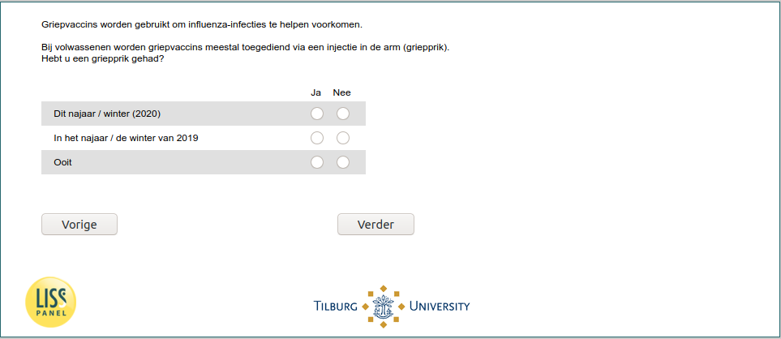

.. _w6e-flushot: 

 
 .. role:: raw-html(raw) 
        :format: html 
 
`flushot` – Taken Influenza Vaccine
============================================= 

:raw-html:`&larr;` :ref:`w6e-covid_test_prob2` | :ref:`w6e-influenza_vaccine_2020_yes_reason` :raw-html:`&rarr;` 
 

Flu vaccines are used to help prevent influenza infections.

In adults, flu vaccines are usually administered through an injection in the arm (flu shot).
Have you had a flu shot?
 
.. csv-table:: 
   :header: ,Yes,No
   :delim: | 
 
           Ever | :raw-html:`&#10063;` | :raw-html:`&#10063;` 
           This Fall/Winter (2020) | :raw-html:`&#10063;` | :raw-html:`&#10063;` 
           In the fall / winter of 2019 | :raw-html:`&#10063;` | :raw-html:`&#10063;` 

:raw-html:`&larr;` :ref:`w6e-covid_test_prob2` | :ref:`w6e-influenza_vaccine_2020_yes_reason` :raw-html:`&rarr;` 
 
