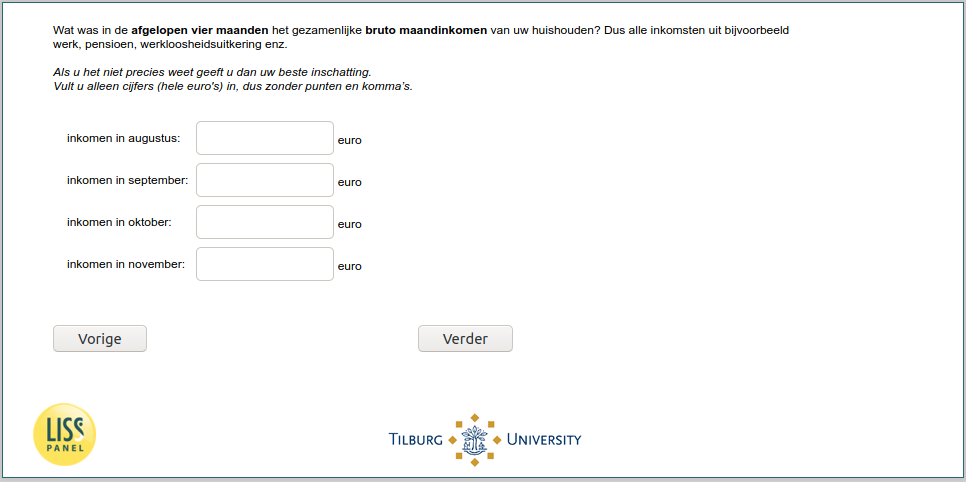

.. _w6e-inc: 

 
 .. role:: raw-html(raw) 
        :format: html 
 
`inc` – Income
==================== 

:raw-html:`&larr;` :ref:`w6e-q27_ex_1` | :ref:`w6e-expinc2020` :raw-html:`&rarr;` 
 

In the past four months, what was [if (p_numberhh = 1): your gross monthly income/ if (p_numberhh ≠ 1): your household's combined gross monthly income]? So all income from e.g. work, pension, unemployment benefit etc.

If you do not know exactly give your best estimate.
Enter only figures (whole euros), without commas.
 
.. csv-table:: 
   :delim: | 
 
           income in august: | :raw-html:`<form><input type="text" id="fname" name="fname"> </form>` 
           income in September: | :raw-html:`<form><input type="text" id="fname" name="fname"> </form>` 
           income in october: | :raw-html:`<form><input type="text" id="fname" name="fname"> </form>` 
           income in November: | :raw-html:`<form><input type="text" id="fname" name="fname"> </form>` 

:raw-html:`&larr;` :ref:`w6e-q27_ex_1` | :ref:`w6e-expinc2020` :raw-html:`&rarr;` 
 
