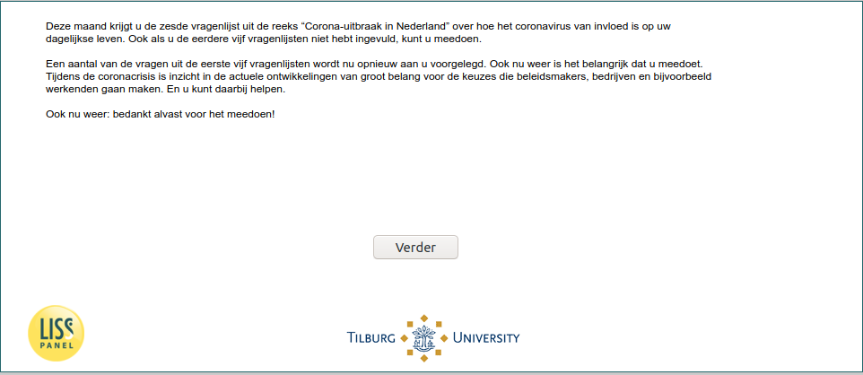

.. _w6e-intro: 

 
 .. role:: raw-html(raw) 
        :format: html 
 
`intro` – Introduction
============================== 

:ref:`w6e-InfectionDiagnosed` :raw-html:`&rarr;` 
 

This month you will receive the sixth questionnaire in the series "Corona outbreak in the Netherlands" about
how the coronavirus affects your daily life. Even if you did not complete the previous five
questionnaires, you can participate.

Some of the questions from the first five questionnaires are now being
questions from the first five questionnaires. Again, it is important that you participate. During the corona crisis, insight into
of current developments is of great importance for the choices that policymakers
companies and, for example, workers will make. And you can help.

Again: thank you for your participation! 
 

:ref:`w6e-InfectionDiagnosed` :raw-html:`&rarr;` 
 
