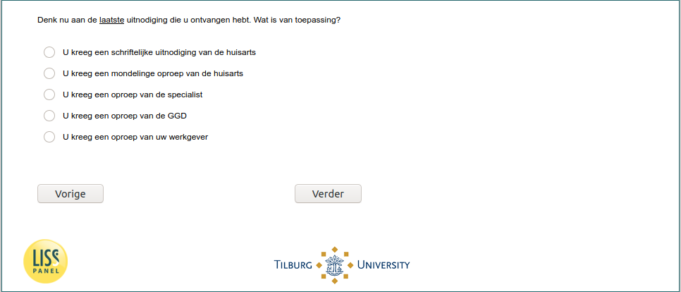

.. _w6e-invite_means: 

 
 .. role:: raw-html(raw) 
        :format: html 
 
`invite_means` – Mean for Invite to Take Influenza Vaccine
========================================================================= 

:raw-html:`&larr;` :ref:`w6e-invite` | :ref:`w6e-flushot_past10y` :raw-html:`&rarr;` 
 
*Routing to the question depends on answer in:* :ref:`w6e-invite` 

Now think about the last invitation you received. What is applicable?

:raw-html:`&#10063;` – You received a written invitation from the family doctor

:raw-html:`&#10063;` – You received a verbal call from the family physician

:raw-html:`&#10063;` – You received a call from the specialist

:raw-html:`&#10063;` – You received a call from the GGD

:raw-html:`&#10063;` – You received a call from your employer
 

:raw-html:`&larr;` :ref:`w6e-invite` | :ref:`w6e-flushot_past10y` :raw-html:`&rarr;` 
 
