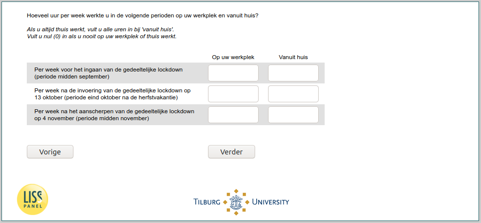

.. _w6e-lockdown: 

 
 .. role:: raw-html(raw) 
        :format: html 
 
`lockdown` – Work During Lockdown
============================================ 

:raw-html:`&larr;` :ref:`w6e-worked_past_3m` | :ref:`w6e-work_perc` :raw-html:`&rarr;` 
 
*Routing to the question depends on answer in:* :ref:`w6e-EmploymentStatus` 

How many hours per week did you work at your workplace and from home during the following periods?

If you always work at home, enter all hours under "from home.
Enter zero (0) if you never work at your workplace or at home.
 
.. csv-table:: 
   :header: ,At your workplace, From home
   :delim: | 
 
           Per week before the partial lockdown takes effect (period mid-September)| :raw-html:`<form><input type="text" id="fname" name="fname"> </form>` | :raw-html:`<form><input type="text" id="fname" name="fname"> </form>` 
           Per week after the partial lockdown takes effect on October 13 (period in late October after the fall break)| :raw-html:`<form><input type="text" id="fname" name="fname"> </form>` | :raw-html:`<form><input type="text" id="fname" name="fname"> </form>` 
           Per week after the tightening of the partial lockdown on November 4 (period mid-November)| :raw-html:`<form><input type="text" id="fname" name="fname"> </form>` | :raw-html:`<form><input type="text" id="fname" name="fname"> </form>` 

:raw-html:`&larr;` :ref:`w6e-worked_past_3m` | :ref:`w6e-work_perc` :raw-html:`&rarr;` 
 
