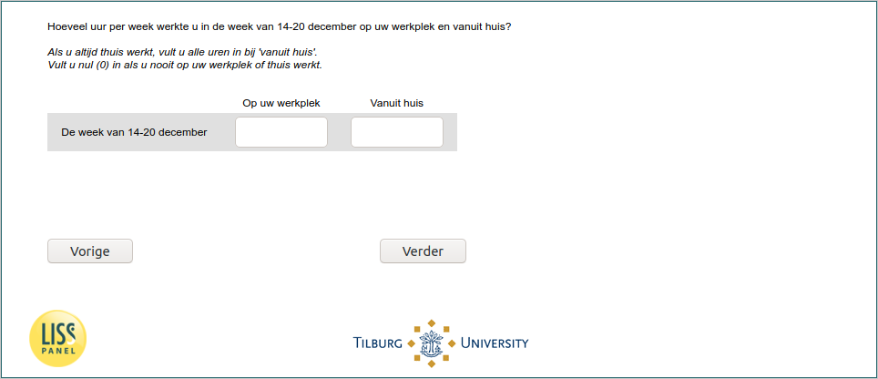

.. _w6e-q14: 

 
 .. role:: raw-html(raw) 
        :format: html 
 
`q14` – Work Time Remote and Workplace
============================================ 

:raw-html:`&larr;` :ref:`w6e-EmploymentStatus` | :ref:`w6e-vacsick` :raw-html:`&rarr;` 
 
*Routing to the question depends on answer in:* :ref:`w6e-EmploymentStatus` 

During the [if _current_date<2020-12-21: past seven days / if _current_date>=2020-12-21: week of December 14-20], how many hours per week did you work at your workplace and from home?

If you always work at home, enter all hours under 'from home'.
Enter zero (0) if you never work at your workplace or at home.
 
.. csv-table:: 
   :header:  ,At your workplace,From home 
   :delim: | 
 
           The [if _current_date<2020-12-21: past seven days/ if _current_date>=2020-12-21: week of December 14-20]| :raw-html:`<form><input type="text" id="fname" name="fname"> </form>` | :raw-html:`<form><input type="text" id="fname" name="fname"> </form>` 

:raw-html:`&larr;` :ref:`w6e-EmploymentStatus` | :ref:`w6e-vacsick` :raw-html:`&rarr;` 
 
