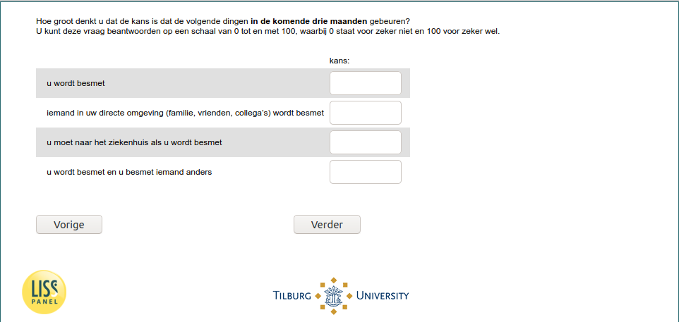

.. _w6e-q1header: 

 
 .. role:: raw-html(raw) 
        :format: html 
 
`q1header` – Subjective Risks
======================================== 

:raw-html:`&larr;` :ref:`w6e-InfectionDiagnosed` | :ref:`w6e-vaccine_intention_jan` :raw-html:`&rarr;` 
 

How likely do you think the following things are to Happen in the next three months?
You can answer this question on a scale of 0 to 100, where 0 means definitely not and 100 means definitely yes.
 
.. csv-table:: 
   :delim: | 
 
           you become infected | :raw-html:`<form><input type="text" id="fname" name="fname"> </form>` 
           someone close to you (family, friends, colleagues) becomes infected | :raw-html:`<form><input type="text" id="fname" name="fname"> </form>` 
           you have to go to hospital if you are infected | :raw-html:`<form><input type="text" id="fname" name="fname"> </form>` 
           you are infected and you infect someone else | :raw-html:`<form><input type="text" id="fname" name="fname"> </form>` 

:raw-html:`&larr;` :ref:`w6e-InfectionDiagnosed` | :ref:`w6e-vaccine_intention_jan` :raw-html:`&rarr;` 
 
