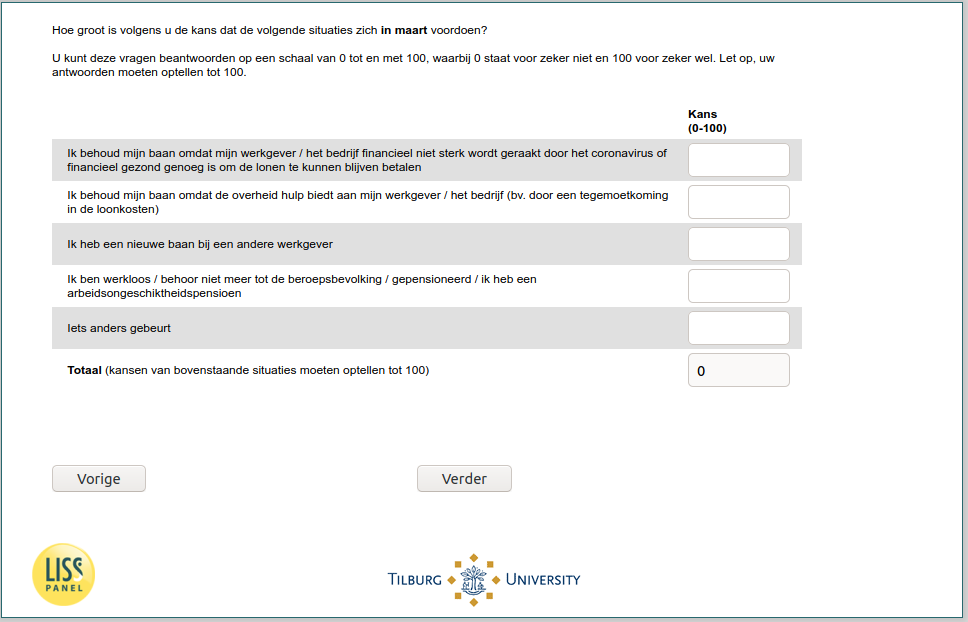

.. _w6e-q26: 

 
 .. role:: raw-html(raw) 
        :format: html 
 
`q26` – Expectations March among Employed
=============================================== 

:raw-html:`&larr;` :ref:`w6e-JobSearch` | :ref:`w6e-q26header_1` :raw-html:`&rarr;` 
 
*Routing to the question depends on answer in:* :ref:`w6e-EmploymentStatus` 

How likely do you think the following situations are to occur in March?

You can answer these questions on a scale of 0 to 100, where 0 represents definitely not and 100 represents definitely yes. Note that your answers must add up to 100.
 
.. csv-table:: 
   :delim: | 
 
           I keep my job because my employer / company is not strongly affected financially by the coronavirus or is financially healthy enough to continue paying wages | :raw-html:`<form><input type="text" id="fname" name="fname"> </form>` 
           I keep my job because the government offers help to my employer / company (e.g. by meeting the costs of wages) | :raw-html:`<form><input type="text" id="fname" name="fname"> </form>` 
           I have a new job with another employer | :raw-html:`<form><input type="text" id="fname" name="fname"> </form>` 
           I am unemployed / no longer part of the labour force / retired / have a disability pension | :raw-html:`<form><input type="text" id="fname" name="fname"> </form>` 
           Something else happens | :raw-html:`<form><input type="text" id="fname" name="fname"> </form>` 

:raw-html:`&larr;` :ref:`w6e-JobSearch` | :ref:`w6e-q26header_1` :raw-html:`&rarr;` 
 
