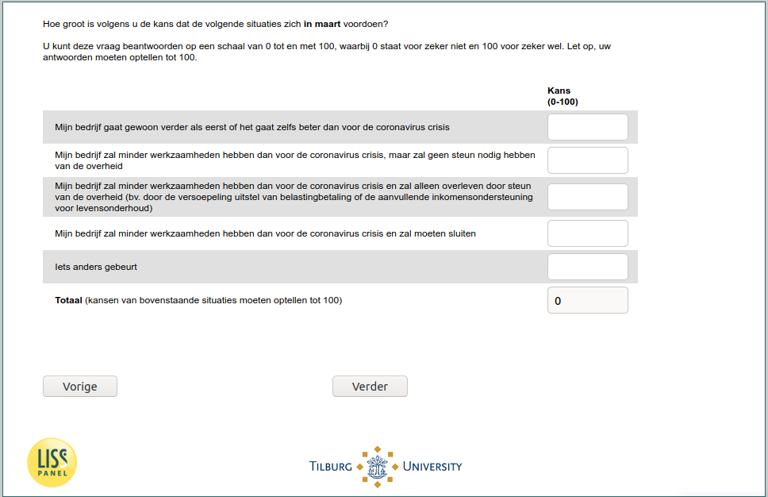

.. _w6e-q27: 

 
 .. role:: raw-html(raw) 
        :format: html 
 
`q27` – Expectations March among Self-Employed
==================================================== 

:raw-html:`&larr;` :ref:`w6e-q26header_1` | :ref:`w6e-q27_1` :raw-html:`&rarr;` 
 
*Routing to the question depends on answer in:* :ref:`w6e-EmploymentStatus` 

How likely do you think the following situations are to occur in March?

You can answer this question on a scale of 0 to 100, where 0 represents definitely not and 100 represents definitely yes. Note that your answers must add up to 100.
 
.. csv-table:: 
   :delim: | 
 
           My company will have less work than before the coronavirus crisis, but will not need government support | :raw-html:`<form><input type="text" id="fname" name="fname"> </form>` 
           My company will have less work than before the coronavirus crisis, but will not need government support | :raw-html:`<form><input type="text" id="fname" name="fname"> </form>` 
           My business will have less work than before the coronavirus crisis and will survive only because of government support (e.g., through the relaxation of tax payment deferral or supplemental income support for living expenses) | :raw-html:`<form><input type="text" id="fname" name="fname"> </form>` 
           My business will have less work than before the coronavirus crisis and will have to close | :raw-html:`<form><input type="text" id="fname" name="fname"> </form>` 
           Something else is happening | :raw-html:`<form><input type="text" id="fname" name="fname"> </form>` 

:raw-html:`&larr;` :ref:`w6e-q26header_1` | :ref:`w6e-q27_1` :raw-html:`&rarr;` 
 
