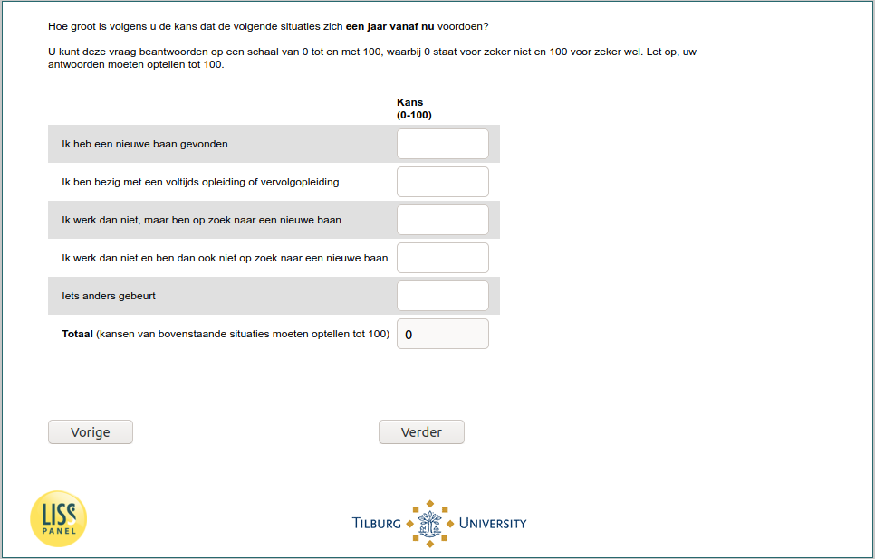

.. _w6e-q27_ex_1: 

 
 .. role:: raw-html(raw) 
        :format: html 
 
`q27_ex_1` – Expectations Next Year among Unemployed
=============================================================== 

:raw-html:`&larr;` :ref:`w6e-q27_ex` | :ref:`w6e-inc` :raw-html:`&rarr;` 
 
*Routing to the question depends on answer in:* :ref:`w6e-EmploymentStatus` 

How likely do you think the following situations are to occur one year from now?

You can answer this question on a scale of 0 to 100, where 0 means definitely not and 100 means definitely yes. Note that your answers must add up to 100.
 
.. csv-table:: 
   :delim: | 
 
           I have found a new job | :raw-html:`<form><input type="text" id="fname" name="fname"> </form>` 
           I am in full-time training or continuing education | :raw-html:`<form><input type="text" id="fname" name="fname"> </form>` 
           I am not working then, but am looking for a new job | :raw-html:`<form><input type="text" id="fname" name="fname"> </form>` 
           I am not working then, nor am I looking for a new job | :raw-html:`<form><input type="text" id="fname" name="fname"> </form>` 
           Something else happens | :raw-html:`<form><input type="text" id="fname" name="fname"> </form>` 

:raw-html:`&larr;` :ref:`w6e-q27_ex` | :ref:`w6e-inc` :raw-html:`&rarr;` 
 
