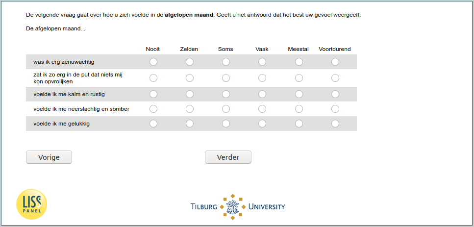

.. _w6e-q30hd_maand: 

 
 .. role:: raw-html(raw) 
        :format: html 
 
`q30hd_maand` – Mental Health in the Past Month
============================================================= 

:raw-html:`&larr;` :ref:`w6e-flu_attitudes` | :ref:`w6e-support` :raw-html:`&rarr;` 
 

The next question is about how you felt in the past month. Please give the answer that best represents your feelings.

Last month…
 
.. csv-table:: 
   :delim: | 
   :header: ,Never ,Rarely ,Sometimes ,Often ,Mostly ,Constantly
 
           I was very nervous | :raw-html:`&#10063;`|:raw-html:`&#10063;`|:raw-html:`&#10063;`|:raw-html:`&#10063;`|:raw-html:`&#10063;`|:raw-html:`&#10063;` 
           I was so down in the dumps that nothing could cheer me up | :raw-html:`&#10063;`|:raw-html:`&#10063;`|:raw-html:`&#10063;`|:raw-html:`&#10063;`|:raw-html:`&#10063;`|:raw-html:`&#10063;` 
           I felt calm and quiet | :raw-html:`&#10063;`|:raw-html:`&#10063;`|:raw-html:`&#10063;`|:raw-html:`&#10063;`|:raw-html:`&#10063;`|:raw-html:`&#10063;` 
           I felt depressed and gloomy | :raw-html:`&#10063;`|:raw-html:`&#10063;`|:raw-html:`&#10063;`|:raw-html:`&#10063;`|:raw-html:`&#10063;`|:raw-html:`&#10063;` 
           I felt happy | :raw-html:`&#10063;`|:raw-html:`&#10063;`|:raw-html:`&#10063;`|:raw-html:`&#10063;`|:raw-html:`&#10063;`|:raw-html:`&#10063;` 

:raw-html:`&larr;` :ref:`w6e-flu_attitudes` | :ref:`w6e-support` :raw-html:`&rarr;` 
 
