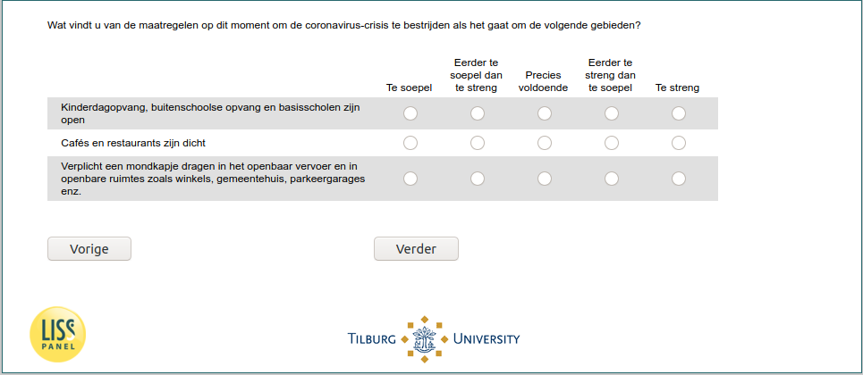

.. _w6e-support: 

 
 .. role:: raw-html(raw) 
        :format: html 
 
`support` – Thoughts on Government Policy
=================================================== 

:raw-html:`&larr;` :ref:`w6e-q30hd_maand` | :ref:`w6e-q8` :raw-html:`&rarr;` 
 

What do you think of the measures currently in place to combat the coronavirus crisis as it relates to the following areas?
 
.. csv-table:: 
   :delim: | 
   :header: ,Too flexible ,Rather too flexible than too strict ,Just enough ,Rather too strict than too flexible ,Too strict
 
           Daycare centers, after-school programs and elementary schools are open | :raw-html:`&#10063;`|:raw-html:`&#10063;`|:raw-html:`&#10063;`|:raw-html:`&#10063;`|:raw-html:`&#10063;` 
           Pubs and restaurants are closed | :raw-html:`&#10063;`|:raw-html:`&#10063;`|:raw-html:`&#10063;`|:raw-html:`&#10063;`|:raw-html:`&#10063;` 
           Mandatory wearing of a mouth mask on public transport and in public places such as stores, city hall, parking garages, etc. | :raw-html:`&#10063;`|:raw-html:`&#10063;`|:raw-html:`&#10063;`|:raw-html:`&#10063;`|:raw-html:`&#10063;` 

:raw-html:`&larr;` :ref:`w6e-q30hd_maand` | :ref:`w6e-q8` :raw-html:`&rarr;` 
 
