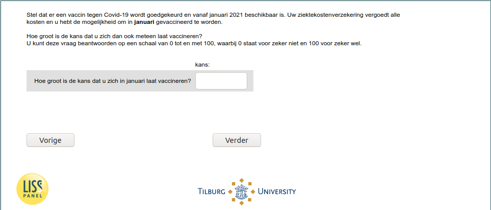

.. _w6e-vaccine_intention_jan: 

 
 .. role:: raw-html(raw) 
        :format: html 
 
`vaccine_intention_jan` – Vaccine Intention - January
============================================================================= 

:raw-html:`&larr;` :ref:`w6e-q1header` | :ref:`w6e-vaccine_intention_jul` :raw-html:`&rarr;` 
 

Suppose a vaccine against Covid-19 is approved and available starting in January 2021. Your health insurance will cover all costs and you have the option to be vaccinated in January.
How likely is it that you will get vaccinated right then? You can answer this question on a scale of 0 to 100, where 0 means definitely not and 100 means definitely yes.
 
.. csv-table:: 
   :delim: | 
 
           How likely are you to get vaccinated in January? | :raw-html:`<form><input type="text" id="fname" name="fname"> </form>` 

:raw-html:`&larr;` :ref:`w6e-q1header` | :ref:`w6e-vaccine_intention_jul` :raw-html:`&rarr;` 
 
