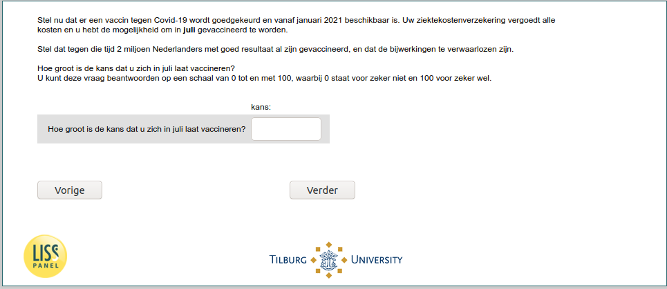

.. _w6e-vaccine_intention_jul: 

 
 .. role:: raw-html(raw) 
        :format: html 
 
`vaccine_intention_jul` – Vaccine Intention – June
========================================================================== 

:raw-html:`&larr;` :ref:`w6e-vaccine_intention_jan` | :ref:`w6e-covid_attitudes` :raw-html:`&rarr;` 
 

Now suppose a vaccine against Covid-19 is approved and available starting in January 2021. Your health insurance will cover all costs and you have the option to be vaccinated in July. 

Suppose that by then 2 million Dutch people have already been vaccinated with good results, and that the side effects are negligible. 

How likely is it that you will be vaccinated in July? You can answer this question on a scale of 0 to 100, where 0 means definitely not and 100 means definitely yes.
 
.. csv-table:: 
   :delim: | 
 
           How likely are you to get vaccinated in July? | :raw-html:`<form><input type="text" id="fname" name="fname"> </form>` 

:raw-html:`&larr;` :ref:`w6e-vaccine_intention_jan` | :ref:`w6e-covid_attitudes` :raw-html:`&rarr;` 
 
