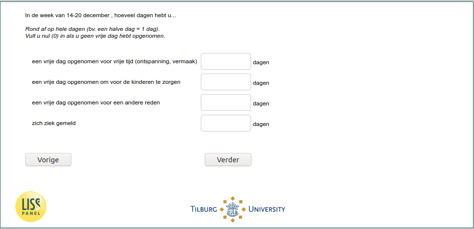

.. _w6e-vacsick: 

 
 .. role:: raw-html(raw) 
        :format: html 
 
`vacsick` – Vacation & Sickness
========================================= 

:raw-html:`&larr;` :ref:`w6e-q14` | :ref:`w6e-worked_past_3m` :raw-html:`&rarr;` 
 
*Routing to the question depends on answer in:* :ref:`w6e-EmploymentStatus` 

In the [if _current_date<2020-12-21: past seven days/ if _current_date>=2020-12-21: week of December 14-20], how many days have you...

Round to whole days (e.g., half a day = 1 day).
Enter zero (0) if you did not take a day off.
 
.. csv-table:: 
   :delim: | 
 
           taken a day off for leisure (relaxation, entertainment) | :raw-html:`<form><input type="text" id="fname" name="fname"> </form>` 
           taken a day off to take care of the children | :raw-html:`<form><input type="text" id="fname" name="fname"> </form>` 
           took a day off for another reason | :raw-html:`<form><input type="text" id="fname" name="fname"> </form>` 
           Called in sick | :raw-html:`<form><input type="text" id="fname" name="fname"> </form>` 

:raw-html:`&larr;` :ref:`w6e-q14` | :ref:`w6e-worked_past_3m` :raw-html:`&rarr;` 
 
