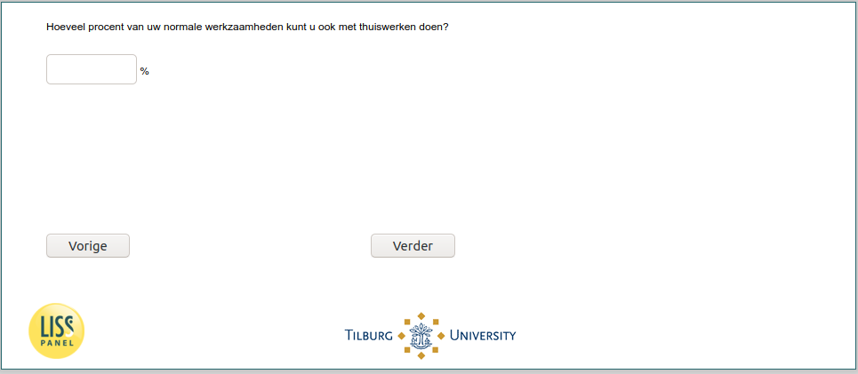

.. _w6e-work_perc: 

 
 .. role:: raw-html(raw) 
        :format: html 
 
`work_perc` – Percentage of Work from Home
====================================================== 

:raw-html:`←` :ref:`w6e-lockdown` | :ref:`w6e-uren_corona` :raw-html:`→` 
 
*Routing to the question depends on answer in:* :ref:`w6e-EmploymentStatus` 

What percentage of your normal work can you do even with working from home? 
 

:raw-html:`←` :ref:`w6e-lockdown` | :ref:`w6e-uren_corona` :raw-html:`→` 
 
