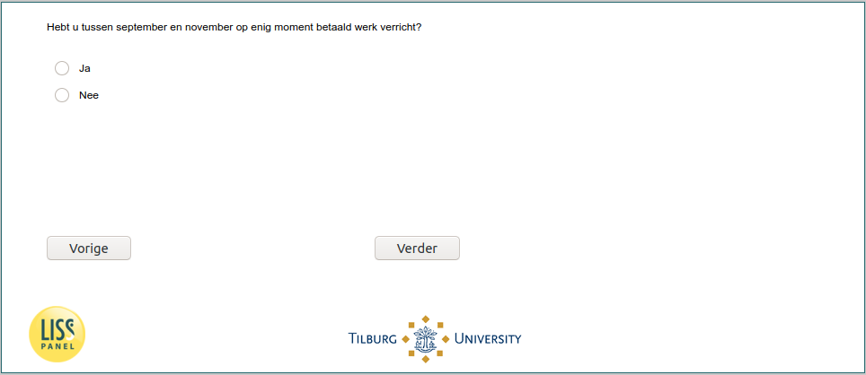

.. _w6e-worked_past_3m: 

 
 .. role:: raw-html(raw) 
        :format: html 
 
`worked_past_3m` – Worked Past Three Months
============================================================ 

:raw-html:`←` :ref:`w6e-vacsick` | :ref:`w6e-lockdown` :raw-html:`→` 
 
*Routing to the question depends on answer in:* :ref:`w6e-EmploymentStatus` 

Did you engage in paid work at any time between September and November?
 
.. csv-table:: 
   :delim: | 
   :header: Yes,No
 
           :raw-html:`❏`|:raw-html:`❏` 

:raw-html:`←` :ref:`w6e-vacsick` | :ref:`w6e-lockdown` :raw-html:`→` 
 
